# Extensibility Tools for Visual Studio

[](https://ci.appveyor.com/project/madskristensen/extensibilitytools)

Download this extension from the [VS Gallery](https://visualstudiogallery.msdn.microsoft.com/ab39a092-1343-46e2-b0f1-6a3f91155aa6)
or get the [nightly build](http://vsixgallery.com/extension/f8330d54-0469-43a7-8fc0-7f19febeb897/).

---------------------------------------

An extension built for and by Visual Studio extension authors.

See the [changelog](CHANGELOG.md) for changes and roadmap.

## Features

- **VSCT files**
  - Intellisense for custom GUIDs
  - Intellisense for custom IDs
  - Intellisense for built-in groups and menus
  - ImageMoniker Intellisense
  - Snippets
  - Auto-sync VSCT commands to C# class
- **Editor margin**
  - Shows document encoding
  - Shows content type of the `ITextBuffer` under caret
  - Shows active classifications under caret
  - Shows caret position and selection range
- Dialog for **digitally signing** VSIXs
- **Pkgdef/pkgundef files**
  - Syntax highlighting
  - Intellisense
  - Snippets
  - Brace matching
  - Validation
  - Formatting
- **VsixManifest files**
  - Auto-sync to Resx file
  - Automatically create .ico file based on icon file
- **Support for VsixGallery.com**
- **Show Project information** (for debug purposes)
- **Export KnownMonikers to PNG file**
- **VS Theme color swatch window**
- **View Activity Log**
- **Enable VSIP Logging**
- **Item templates**
  - Snippet file
  - Browser Link Provider class
  - Editor drop handler

### VSCT files
The Visual Studio Command Table leaves a lot to be desired in terms of
both Intellisense and discoverability of even the most common use cases.

This extension improves on that.

#### Intellisense for custom GUIDs
Get Intellisense for symbols and groups through out the .vsct file
whether you're defining `Groups`, `Menus`, `Buttons`, `KeyBindings` or 
`CommandPlacements`.

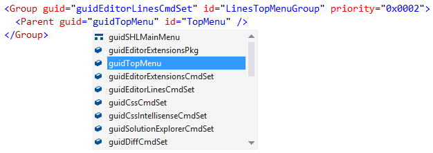

#### Intellisense for custom IDs
Provides Intellisense for IDs based on the `guid` attribute on
the same XML element.

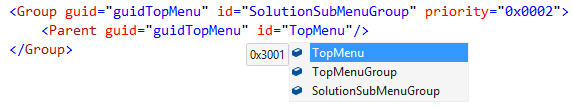

#### Intellisense built-in groups and menus
All the built-in groups and menus are located under the `guidSHLMainMenu`
GUID and Intellisense is now provided for all the corresponding IDs.

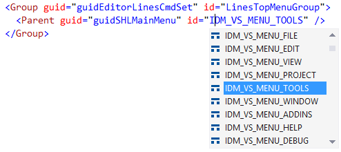

#### ImageMoniker Intellisense
Over 3500 images is available as ImageMonikers in the KnownMonikers
collection in VS. You can now see all the images directly inside
Intellisense.

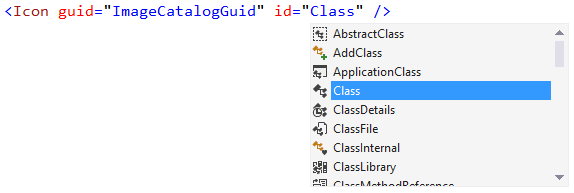

#### Snippets
All main XML elements in the VSCT file has snippets associated with
them and can be invoked by hitting the Tab key.


#### Auto-sync VSCT commands
Auto-generate the `PackageGuids` and `PackageIds` classes every time
you save the VSCT file. This keeps your code in sync with the VSCT file
at all times.

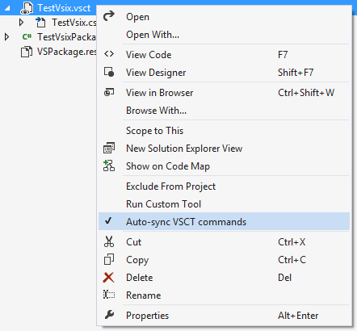

*Feature contributed by [phofman](https://github.com/phofman/)*

### Editor margin
The margin is located below the bottom scrollbar and comes in handy
when writing extensions that extends the VS editor.


#### Document encoding
Shows the encoding of the current document and more details on hover.


#### Content type
Shows the content type of the `ITextBuffer` at the caret position. The
over tooltip shows the name of the base content type.

#### Classification
Displays the name of the classification at the caret position in the
document. The hover tooltip shows the inheritance hierarchy of the
`EditorFormatDefinition`'s `BaseDefinition` attribute.


#### Selection
Displays the start and end position of the editor selection as
well as the total length of the selection.


### Pkgdef files

#### Syntax highlighting
Colorizes registry keys, strings, keywords, comments and more.


#### Intellisense
Intellisense is provided for tokens and GUIDs.


#### Snippets
By typing a question mark on an empty line, a list of snippets appear.
Hit `Tab` on the snippet you want and it will be inserted.


#### Brace matching
Matches parentheses and square brackets.

#### Validation
Validates various common mistakes like unknown tokens and unclosed strings and braces.


#### Formatting
Format the entire document or just the selected lines.

### VsixManifest files
You can enable auto-sync on any .vsixmanifest file. Simply
right-click the file in Solution Explorer and select
**Auto-sync Resx and Icon Files**.

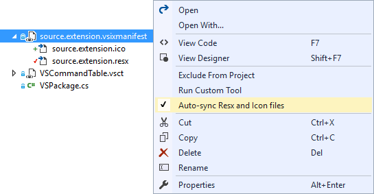

#### Auto-sync resx files
This will generate a file called _source.extension.resx_
that is designed to replace the _VSPackage.resx_ file
that is added by default by the VSIX project template.

Whenever you change the .vsixmanifest file, the .resx
files is updated accordingly as well.

#### Auto-sync icon file
Icon files (.ico) are always hard to create and maintain,
so this feature will auto-generate it for you automatically.

All there is required is that you've referenced an image
file in the .vsixmanifest's _Icon_ property and a new
.ico file is automtically generated with the right dimensions
for VS extensions.

#### Auto-sync C# class file
A C# class file is also produced which contains a static
class with various string constants such as Name, 
Description and Version of the VSIX.

**Example:**
```C#
namespace MyExtension
{
    public static class Vsix
    {
        public const string Id = "f86b5aa5-733c-4e8f-8d3b-ea6f9b97b344";        
        public const string Name = "Name of VSIX";
        public const string Description = "Description of VSIX";
        public const string Version = "1.0";
    }
}
```

### Support for VsixGallery.com
[VsixGallery.com](http://vsixgallery.com) is an open source
gallery for Visual Studio extensions and is primarily used
for hosting CI built extensions - a staging environment.

There are two things that make automatic integration with
VsixGallery.com easy. Put your code on GitHub and automate
the build process with [AppVeyor](http://appveyor.com).

It sounds like a lot of work, but it isn't. Right-click the
solution node in Solution Explorer and click both of the
buttons shown below.

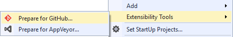

That will add some files to the solution folder that require
almost no modifications by you. These files are AppVeyor.yml
as well as common GitHub files such as CONTRIBUTION.md
(tailored to VSIX development), CHANGELOG.md etc.

Read more about 
[adding your extension](http://vsixgallery.com/guide/dev/)
to VsixGallery.

### Show Project Information
A context-menu command is available on every project type that
makes it very easy to see all the properties on said project.

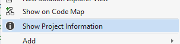

This makes it easy to troubleshoot and debug project related issues.

### Export KnownMonikers to file
You can now easily export any of the KnownMonikers from
`IVsImageService2` to a PNG file on disk in the size you
need it in.

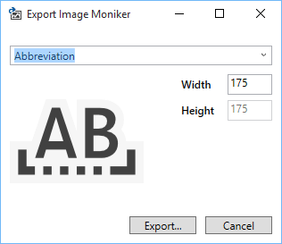

The button to invoke the **Export Image Moniker** dialog is
located in the top level **Tools** menu.

### Theme color swatch window
To see all the VS environment colors available used in
the Light, Blue and Dark theme, you can use the
**Theme Swatches** window.

Open it from **View -> Other Windows -> Theme Swatches**

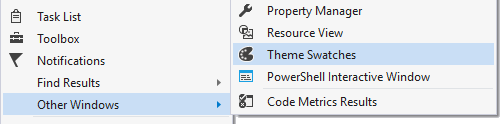

The tool window lets you search for colors and provides an
easy way to copy them into XAML or C#.

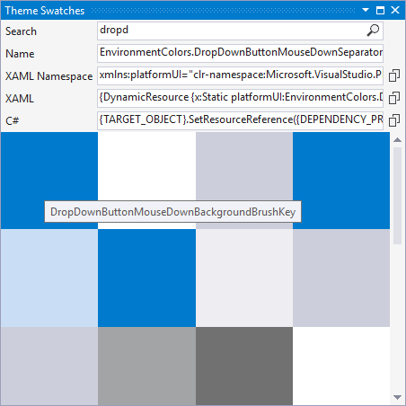

### View Activity Log
Getting to the Visual Studio Activity Log can sometimes
be a bit cumbersome when dealing with both the regular
and the experimental instance.

A menu command under the top level View menu let's you
open the right Activity Log easily.


This will open the Activity Log in the Visual Studio
web browser.

### Enable VSIP Logging
VSIP Logging allows you to see GUIDs and command ids
for menu commands. Just press **Ctrl+Shift** as you
click a menu item or group with the mouse.

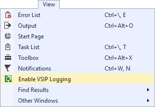

Read more about 
[VSIP Logging](http://blogs.msdn.com/b/dr._ex/archive/2007/04/17/using-enablevsiplogging-to-identify-menus-and-commands-with-vs-2005-sp1.aspx).

### Item Templates
Several item templates are added to make it easier to
create extension. These item templates all come with
functionality that's easy to modify to your needs.

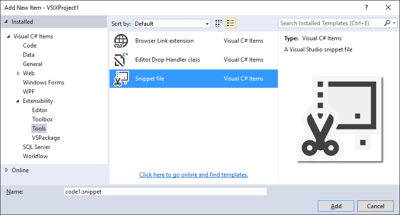

## Contribute
Check out the [contribution guidelines](.github/CONTRIBUTING.md)
if you want to contribute to this project.

## License
[Apache 2.0](LICENSE)
