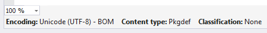
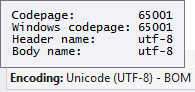
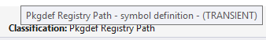
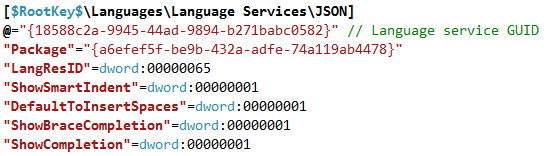
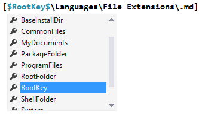
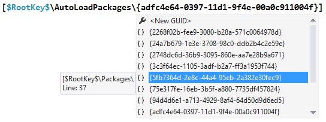

## Extensibility Tools for Visual Studio

An extension built for and by Visual Studio extension writers.

Download this extension from the [VS Gallery](https://visualstudiogallery.msdn.microsoft.com/ab39a092-1343-46e2-b0f1-6a3f91155aa6)
or get the [nightly build](http://vsixgallery.com/extension/f8330d54-0469-43a7-8fc0-7f19febeb897/).

### Editor margin
The margin is located below the bottom scrollbar. This comes in handy
when writing extensions that extends the VS editor.

#### Document encoding
Shows the encoding of the current document and more details on hover.

#### Content type
Shows the content type of the textbuffer at the caret position. The
over tooltip shows the name of the base content type.

#### Classification
Displays the name of the classification at the caret position in the
document. The hover tooltip shows the inheritance hierarchy of the
`EditorFormatDefinition`'s `BaseDefinition` attribute.

### Pkgdef files

#### Syntax highlighting
Colorizes registry keys, strings, keywords, comments and more.

#### Intellisense
Intellisense is provided for tokens and GUIDs.

#### Snippets
By typing a question mark on an empty line, a list of snippets appear.
Hit `Tab` on the snippet you want and it will be inserted.

#### Brace matching
Matches parantheses and square brackets.

#### Validation
Validates various common mistakes like unknown tokens and unclosed strings and braces.

#### Formatting
Format the entire document or just the selected lines.